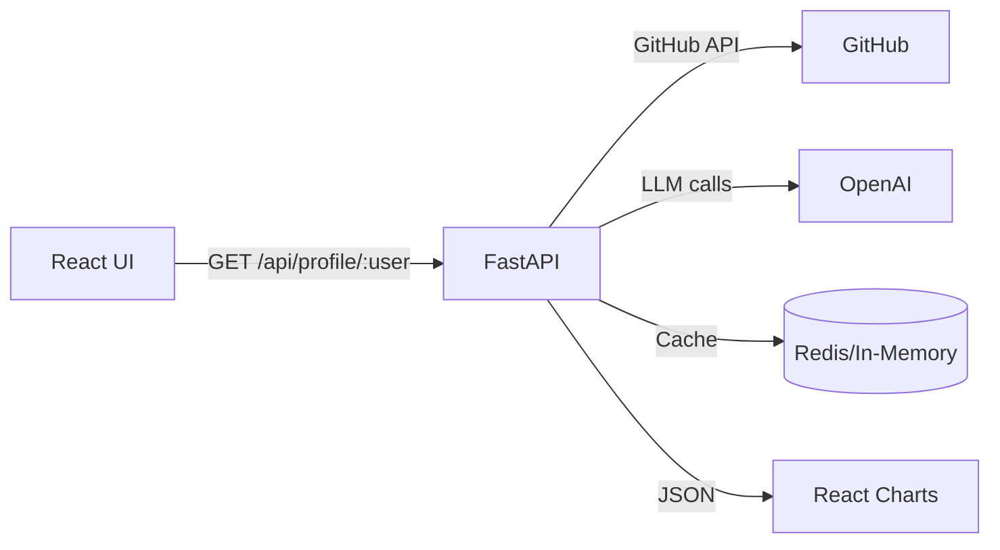

# AI-powered GitHub Repository Analyzer

[](#)
[](#)
[](#)

## Description
An interactive tool to analyze GitHub profiles and repositories using FastAPI, React, and OpenAI.  
Generates language breakdowns, star/fork trends, activity heatmaps, README quality scores, keyword suggestions, and a simple AI chat interface.

## Demo


## Features
- **Profile Overview**: Avatar, bio, followers, public repos, pinned repos  
- **Language Breakdown**: Pie/bar charts with usage percentages  
- **Star & Fork Trends**: Sorted time-series or top-N lists  
- **Activity Heatmap**: Push activity by date  
- **README Analysis**: LLM-generated summary, suggestions, readability score, missing sections  
- **Keyword Extraction**: Top-5 README keywords via LLM  
- **Simple Q&A Chat**: One-turn AI chat on any repository context  

## Architecture


## Tech Stack
- **Backend**: Python, FastAPI, HTTPX, aioredis  
- **AI**: OpenAI GPT-3.5-turbo  
- **Frontend**: React, Axios, Chart.js, React-Chartjs-2  
- **Styling**: Tailwind CSS (optional)  
- **Testing**: pytest, React Testing Library  
- **Deployment**: Docker, Vercel/Heroku

## Installation

```bash
git clone https://github.com/your-org/your-repo.git
cd your-repo
```

### Backend

```bash
cd backend
python -m venv venv
source venv/bin/activate
pip install -r requirements.txt
uvicorn app.main:app --reload
```

### Frontend

```bash
cd frontend
npm install
npm start
```

## Environment Variables

Create a `.env` file in `backend/`:

```env
GITHUB_TOKEN=your_github_personal_access_token
OPENAI_API_KEY=your_openai_api_key
REDIS_URL=redis://localhost:6379/0
```

## API Endpoints

### Profile & Trends
- `GET /api/profile/{username}`  
  Response: `{ profile, repos, language_breakdown, star_trend, fork_trend, heatmap }`

### README Analysis
- `GET /api/profile/{username}/readme-report`  
  Response: `{ reports: [ { repo, analysis } ] }`

### Keywords
- `GET /api/profile/{username}/keywords`  
  Response: `{ repo, keywords: [ ... ] }`

### Chat
- `POST /api/chat`  
  Body: `{ "question": "your question here" }`  
  Response: `{ "answer": "AI response" }`

## Contributing
1. Fork the repository  
2. Create a feature branch (`git checkout -b feature/XYZ`)  
3. Commit changes (`git commit -m "Add feature XYZ"`)  
4. Push (`git push origin feature/XYZ`)  
5. Open a Pull Request

Please follow code style guidelines and add tests for new features.

## License
This project is licensed under the MIT License.